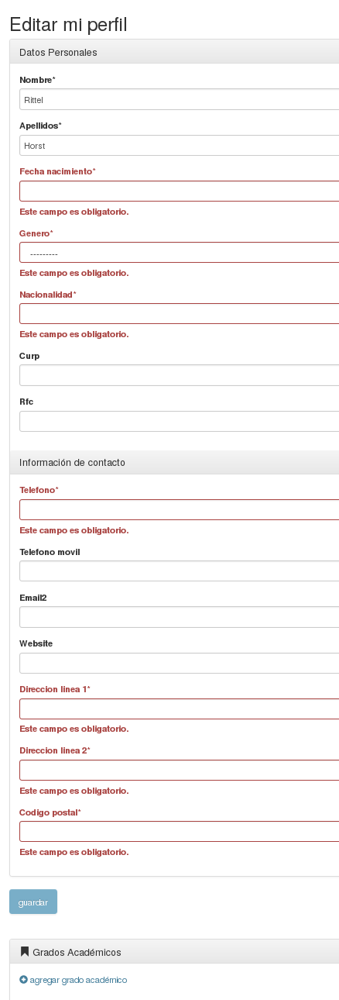
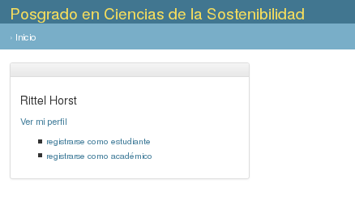

# Sistema de Gestión Programas de Posgrados

El diseño del sistema se registra en casos de uso y estructura de datos.

## Casos de Uso

Son textos breves que describen la funcionalidad deseada para cada
tipo de usuario. Hay tres categorías generales:

- [Usuarios en la coordinación del posgrado](coordinacion/)
- [Usuarios Académicos](academicos/)
- [Usuarios Estudiantes](estudiantes/)

## Usuarios registrados

Tras registrarse se solicita al usuario que complete su perfil.

El formulario de edición de perfil también permite [agregar grados académicos](grado_academico.png).

De manera temporal un usuario registrado puede elegir ser académico o
estudiante. El proceso de registro como estudiante aún no está
especificado.

- [solicitar registro al posgrado como académico](registrar_academico.md).
- [solicitar registro al posgrado como estudiante](registrar_estudiante.md)

## Usuarios anónimos

 - [Registro](anonimos/registro.md)
 - [Leer páginas web](anonimos/registro.md)
