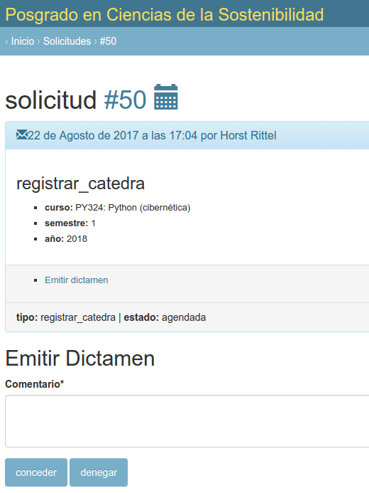
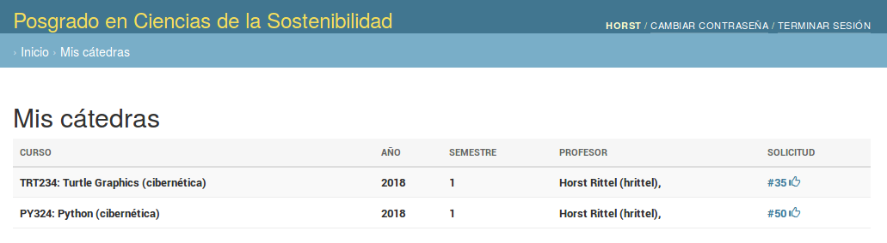

# Registrar cátedra

Un académico quiere impartir un curso durante el siguiente
semestre. Un curso se imparte a través de la cátedra de un académico.

El sistema permite a los académicos solicitar la cátedra de algún curso.

La solicitud es dictaminada por el comité académico.

Si el comité académico concede la colicitud la cátedra se registra como impartida por el académico que la ha solicitado.

