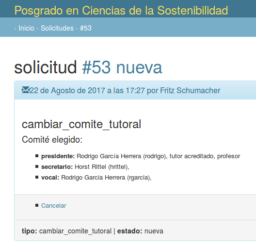
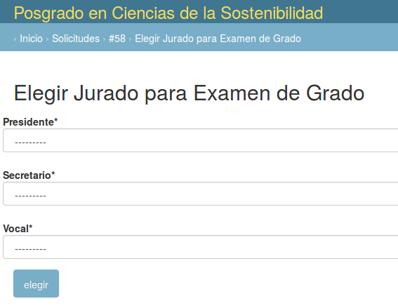

# Selección de comité tutoral

El aspirante a estudiante de doctorado deberá elegir miembros del
padrón de tutores acreditados del Programa para formar parte de su
Comité Tutor.

La solicitud de "elegir comité tutoral" permite registrar Presidente,
Secretario y Vocal de entre el padrón de Tutores.

# Selección de jurado para Candidatura o Examen de Grado

De igual manera hay solicitudes para elegir estos otros jurados:

Los tutores mencionados en las solicitudes de cualquiera de estos
comités reciben notificación por correo y pueden emitir
pre-dictámenes.

