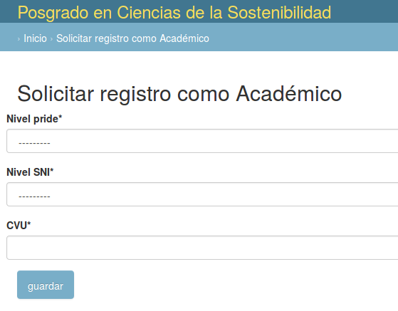
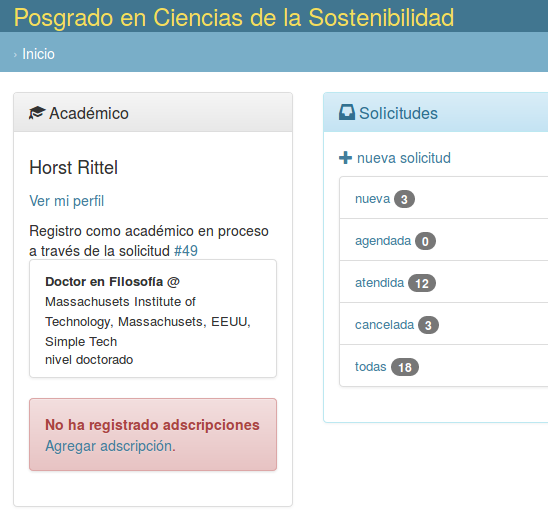

# Registrar Académico

Un usuario puede solicitar su registro como académico.

Al capturar datos para nivel PRIDE, SNI y CVU se registra la solicutd.

El usuario queda registrado como académico cuando el comité académico concede su solicitud.

