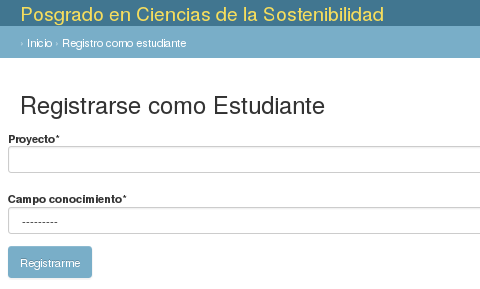
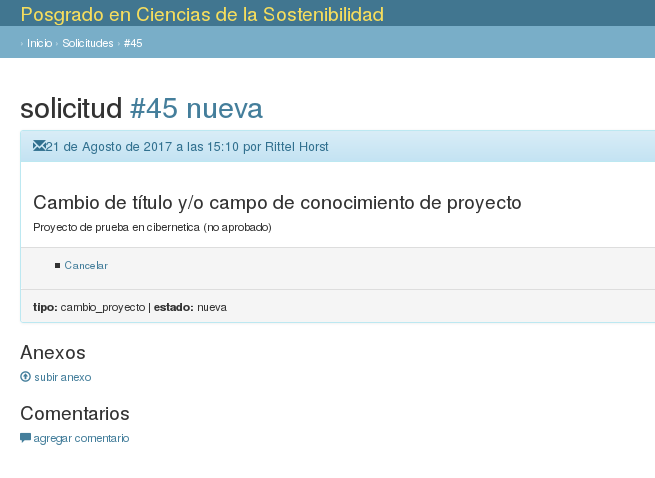

# Registro de estudiantes

Esta funcionalidad no está especificada.

De manera temporal:

 1. se solicita al usuario un título de proyecto y un área de conocimiento.
    

 2. Se crea una solicitud de aprobación de este proyecto.
    

La pantalla de inicio de un estudiante recién registrado se ve algo así:

