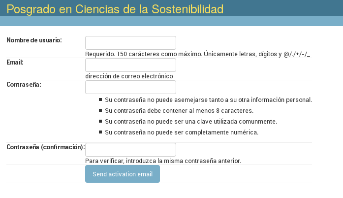

# Registro de usuarios anónimos

Antes de registrarse un usuario es anónimo. Para registrarse llena este formulario:

http://sostenibilidad.posgrado.unam.mx:8080/accounts/register/

El sistema crea el usuario y envía un correo electrónico con un código
de activación. De esta manera se verifica el correo electrónico.
  
  
# Páginas web

Los usuarios anónimos también pueden leer materiales accesibles en
zonas públicas del sistema, como reglamentos y anuncios.

Para publicar páginas web se usan las "Páginas estáticas", que admiten
HTML y una dirección para publicarlo.

